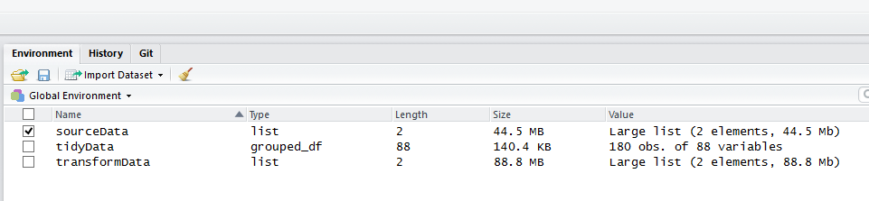

# CodeBook

## Data

### Description
The experiments have been carried out with a group of 30 volunteers within an age bracket of 19-48 years. Each person performed six activities (WALKING, WALKING_UPSTAIRS, WALKING_DOWNSTAIRS, SITTING, STANDING, LAYING) wearing a smartphone (Samsung Galaxy S II) on the waist. Using its embedded accelerometer and gyroscope, we captured 3-axial linear acceleration and 3-axial angular velocity at a constant rate of 50Hz. The experiments have been video-recorded to label the data manually. The obtained dataset has been randomly partitioned into two sets, where 70% of the volunteers was selected for generating the training data and 30% the test data.

### output R Data dataframes
`sourceData`: is the R variable that is produced when [`run_analysis)`](https://github.com/JulesBuh/CleaningData/blob/master/CodeBook.md#functions) function is run. It contains structured lists of the source data, see Transformations section below for a description of functions that process the source data into this dataframe.

`transformData`: is the R variable that is produced as an intermediary dataframe which contains the dataframe after merging.

`tidyData`: is the R variable that is produced after the full dataset has been merged. it contains a dataframe that is the result of extracting and summarising the data and summarises the average of each variable for each subject.

Each variable that is a list contains multiple elements, use the `$` to navigate in the R console command line

### output files
[`metadataLog.txt`](https://github.com/JulesBuh/CleaningData/blob/master/metadataLog.txt): an output file which displays a log that records the process and timestamps for the output.
[`transformData.txt`](https://github.com/JulesBuh/CleaningData/blob/master/transformData.txt): an output file which contains the full dataset.
[`tidyData.txt`](https://github.com/JulesBuh/CleaningData/blob/master/tidyData.txt): an output file which only shows mean and standard deviation values for subject and activity.

## Study design
### Reference 
The source data was downloaded from https://d396qusza40orc.cloudfront.net/getdata%2Fprojectfiles%2FUCI%20HAR%20Dataset.zip

See the README.txt in the [link to the zip folder](https://d396qusza40orc.cloudfront.net/getdata%2Fprojectfiles%2FUCI%20HAR%20Dataset.zip) for a fuller explanation of the dataset source files.

[1] Davide Anguita, Alessandro Ghio, Luca Oneto, Xavier Parra and Jorge L. Reyes-Ortiz. Human Activity Recognition on Smartphones using a Multiclass Hardware-Friendly Support Vector Machine. International Workshop of Ambient Assisted Living (IWAAL 2012). Vitoria-Gasteiz, Spain. Dec 2012
 
## Variables

In addition to the source file variables which can be found within the features.txt and features_info.txt of the [source data](https://d396qusza40orc.cloudfront.net/getdata%2Fprojectfiles%2FUCI%20HAR%20Dataset.zip), 3 additional variable are created as a result of the transformation described below:

 `group`:   Defines the dataset from which the record came from {values: `test`,`train`}
 
 `activity`: Displays the written label for the observation rather than the index which was provided in ./`group`/y_`group`.txt
 
 `subjectID`: Displays that the data which was provided in ./[group]/subject_[group].txt
 
 The original labels containing `mean` and `std` are filtered and a rename process has occured on them. See [Notes](https://github.com/JulesBuh/CleaningData/blob/master/CodeBook.md#notes) for more detail of the renaming process.
 
`subjectID` 

`activity` 

`time.body.acceleration-mean-x` 

`time.body.acceleration-mean-y` 

`time.body.acceleration-mean-z` 

`time.gravity.acceleration-mean-x` 

`time.gravity.acceleration-mean-y` 

`time.gravity.acceleration-mean-z` 

`time.body.accelerationjerk-mean-x` 

`time.body.accelerationjerk-mean-y` 

`time.body.accelerationjerk-mean-z` 

`time.bodygyro-mean-x` 

`time.bodygyro-mean-y` 

`time.bodygyro-mean-z` 

`time.bodygyrojerk-mean-x` 

`time.bodygyrojerk-mean-y` 

`time.bodygyrojerk-mean-z` 

`time.body.acceleration.magnitude-mean` 

`time.gravity.acceleration.magnitude-mean` 

`time.body.accelerationjerk.magnitude-mean` 

`time.bodygyro.magnitude-mean` 

`time.bodygyrojerk.magnitude-mean` 

`frequency.body.acceleration-mean-x` 

`frequency.body.acceleration-mean-y` 

`frequency.body.acceleration-mean-z` 

`frequency.body.acceleration-meanfreq-x` 

`frequency.body.acceleration-meanfreq-y` 

`frequency.body.acceleration-meanfreq-z` 

`frequency.body.accelerationjerk-mean-x` 

`frequency.body.accelerationjerk-mean-y` 

`frequency.body.accelerationjerk-mean-z` 

`frequency.body.accelerationjerk-meanfreq-x` 

`frequency.body.accelerationjerk-meanfreq-y` 

`frequency.body.accelerationjerk-meanfreq-z` 

`frequency.bodygyro-mean-x` 

`frequency.bodygyro-mean-y` 

`frequency.bodygyro-mean-z` 

`frequency.bodygyro-meanfreq-x` 

`frequency.bodygyro-meanfreq-y` 

`frequency.bodygyro-meanfreq-z` 

`frequency.body.acceleration.magnitude-mean` 

`frequency.body.acceleration.magnitude-meanfreq` 

`frequency.bodybody.accelerationjerk.magnitude-mean` 

`frequency.bodybody.accelerationjerk.magnitude-meanfreq` 

`frequency.bodybodygyro.magnitude-mean` 

`frequency.bodybodygyro.magnitude-meanfreq` 

`frequency.bodybodygyrojerk.magnitude-mean` 

`frequency.bodybodygyrojerk.magnitude-meanfreq` 

`angletime.body.accelerationmeangravity` 

`angletime.body.accelerationjerkmeangravitymean` 

`angletime.bodygyromeangravitymean` 

`angletime.bodygyrojerkmeangravitymean` 

`anglexgravitymean` 

`angleygravitymean` 

`anglezgravitymean` 

`time.body.acceleration-std-x` 

`time.body.acceleration-std-y` 

`time.body.acceleration-std-z` 

`time.gravity.acceleration-std-x` 

`time.gravity.acceleration-std-y` 

`time.gravity.acceleration-std-z` 

`time.body.accelerationjerk-std-x` 

`time.body.accelerationjerk-std-y` 

`time.body.accelerationjerk-std-z` 

`time.bodygyro-std-x` 

`time.bodygyro-std-y` 

`time.bodygyro-std-z` 

`time.bodygyrojerk-std-x` 

`time.bodygyrojerk-std-y` 

`time.bodygyrojerk-std-z` 

`time.body.acceleration.magnitude-std` 

`time.gravity.acceleration.magnitude-std` 

`time.body.accelerationjerk.magnitude-std` 

`time.bodygyro.magnitude-std` 

`time.bodygyrojerk.magnitude-std` 

`frequency.body.acceleration-std-x` 

`frequency.body.acceleration-std-y` 

`frequency.body.acceleration-std-z` 

`frequency.body.accelerationjerk-std-x` 

`frequency.body.accelerationjerk-std-y` 

`frequency.body.accelerationjerk-std-z` 

`frequency.bodygyro-std-x` 

`frequency.bodygyro-std-y` 

`frequency.bodygyro-std-z` 

`frequency.body.acceleration.magnitude-std` 

`frequency.bodybody.accelerationjerk.magnitude-std` 

`frequency.bodybodygyro.magnitude-std` 

`frequency.bodybodygyrojerk.magnitude-std` 
 
## Transformations

### Software

    platform       x86_64-w64-mingw32          
    arch           x86_64                      
    os             mingw32                     
    system         x86_64, mingw32             
    major          3                           
    minor          3.2                         
    year           2016                        
    month          10                          
    day            31                          
    svn rev        71607                       
    language       R                           
    version.string R version 3.3.2 (2016-10-31)

### R package dependencies
    `stringr::    1.1.0`
    `dplyr::      0.5.0`
    `library::    1.6.0`

### sourceCode
['run_analysis.R`](https://github.com/JulesBuh/CleaningData/blob/master/run_analysis.R) is the file which contains the assignment function
#### Functions
[`loadAssignment()`](https://github.com/JulesBuh/CleaningData/blob/master/run_analysis.R#L7): - This performs the datagrab from the source and processes it to produce the [`assignmentData`](https://github.com/JulesBuh/CleaningData/blob/master/CodeBook.md#output-r-data-dataframes) dataframe. During this function, the fuller data set with all variables is also saved to the variable  [`assignmentData_FullVarSet`](https://github.com/JulesBuh/CleaningData/blob/master/CodeBook.md#output-r-data-dataframes)
it is made up of a number internal functions:      

   [`source_Assignment()`](https://github.com/JulesBuh/CleaningData/blob/master/run_analysis.R#L210):     obtains the data from the download link
   
   [`read_Assignment_Data()`](https://github.com/JulesBuh/CleaningData/blob/master/run_analysis.R#L296):   reads the observation data from multiple txt files
  
   [`rename_Label()`](https://github.com/JulesBuh/CleaningData/blob/master/run_analysis.R#L173):  defines a function to rename the labels which is used in `readlabels()`
   
   [`read_Label_Data()`](https://github.com/JulesBuh/CleaningData/blob/master/run_analysis.R#L413):  reads the label data from multiple txt files
   
   [`map_descriptions()`](https://github.com/JulesBuh/CleaningData/blob/master/run_analysis.R#L516):  maps the descriptions to the column headers and the activities
   
   [`append_Columns()`](https://github.com/JulesBuh/CleaningData/blob/master/run_analysis.R#L557):    performs operations adds the subject and activity columns to the observation data for the test and train data set
   
   [`merge_Datasets()`](https://github.com/JulesBuh/CleaningData/blob/master/run_analysis.R#L589): joins the test and train datasets together into one full dataframe
   
   [`filter_Variables()`](https://github.com/JulesBuh/CleaningData/blob/master/run_analysis.R#L601): filters the variables down to only observataions that contain mean or std in their description
   
[`extract_Data()`](https://github.com/JulesBuh/CleaningData/blob/master/run_analysis.R#L612): - This performs average by subject and activty for each variable and creates a duplicate dataframe called `tidyData` 

     
For more information read the #comments in the [run_analysis.R script](https://github.com/JulesBuh/CleaningData/blob/master/run_analysis.R)
##### Function Structure
Each function within the script is structured as follows:

     Section
   
   [`- Description`](https://github.com/JulesBuh/CleaningData/blob/master/run_analysis.R#L8)
   
   [`0 Dependencies and Input validation`](https://github.com/JulesBuh/CleaningData/blob/master/run_analysis.R#L29)
   
   [`1 Function Body`](https://github.com/JulesBuh/CleaningData/blob/master/run_analysis.R#L248)
   
   [`1.#   Sub step demarcation`](https://github.com/JulesBuh/CleaningData/blob/master/run_analysis.R#L226)
    
   ...
    
   [`9     Returns demarcation`](https://github.com/JulesBuh/CleaningData/blob/master/run_analysis.R#L286)
   
   

### Notes
Some of the variables in the [original source dataset](https://d396qusza40orc.cloudfront.net/getdata%2Fprojectfiles%2FUCI%20HAR%20Dataset.zip) described in features.txt are not unique which conflicts with the `dplyr` functions.
To overcome this `make.unique()` is used on the this file after it is loaded and the ~~~ seperator is used followed by a unique number and all alpha-character are transformed to `lowercase`.
Some characters are replaced with words which are concatenated by `.`
See the `rename_Label()` function for more detail or view the [`metadataLog.txt`](https://github.com/JulesBuh/CleaningData/blob/master/metadataLog.txt) for a sample.

For more detail of the transformation of the label names see [`rename_label()`](https://github.com/JulesBuh/CleaningData/blob/master/run_analysis.R#L173) function.

License:
========
Use of this dataset in publications must be acknowledged by referencing the following publication [1]

[1] Davide Anguita, Alessandro Ghio, Luca Oneto, Xavier Parra and Jorge L. Reyes-Ortiz. Human Activity Recognition on Smartphones using a Multiclass Hardware-Friendly Support Vector Machine. International Workshop of Ambient Assisted Living (IWAAL 2012). Vitoria-Gasteiz, Spain. Dec 2012

This dataset is distributed AS-IS and no responsibility implied or explicit can be addressed to the authors or their institutions for its use or misuse. Any commercial use is prohibited.

Jorge L. Reyes-Ortiz, Alessandro Ghio, Luca Oneto, Davide Anguita. November 2012.

